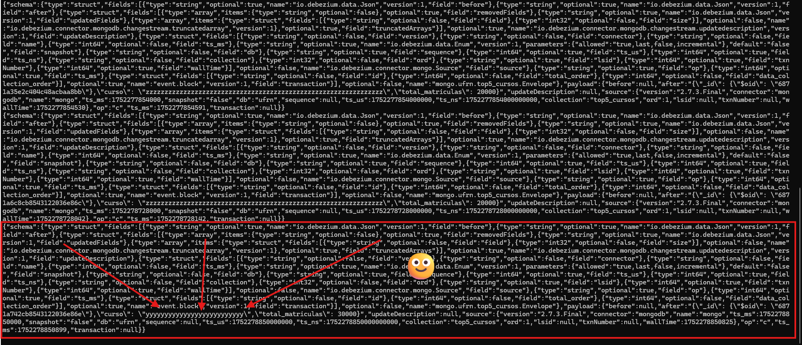

# Trabalho 05
Grupo: Pedro Leandro Batista Marques e Ruan Lucas Brito Neves

# Objetivos do trabalho
De acordo com o material disponibilizado: "Esta prática consiste em construir uma aplicação para consumo e processamento de dados em tempo real utilizando Spark Streaming, Apache Kaka e MongoDB."

# Tarefa 1

## Preparar o ambiente com a instalação e configuração da ferramenta Apache Spark :white_check_mark:

Para configurar o ambiente, nos baseamos no [repositório disponibilizado pelo professor Viegas](https://github.com/cmdviegas/hadoop-spark). Porém, fizemos uma adição do [_Dockerfile_](./Dockerfile), para já instalar o _pymongo_ ao dar o build no cluster:

```sh
RUN \
    (...)
pip install -q --break-system-packages --no-warn-script-location \
        pandas==2.2.3 \
        grpcio==1.68.1 \
        grpcio-status \
        protobuf==5.28.3 \
        graphframes \
        pyspark==${SPARK_VERSION} \
        pyarrow==20.0.0 \
        jupyterlab==4.4.2 \
        pymongo \ # <============================= Adição do pymongo
    (...)
```

Além disso, o [_docker-compose_](./docker-compose.yml) foi inalterado. Dessa forma, o Apache Spark foi instalado e corretamente configurado. Para buildar e executar o container, executamos os comandos:

```sh
docker compose run --rm init
docker compose build && docker compose up
```

## Preparar o ambiente com a instalação e configuração da ferramenta MongoDB :white_check_mark:

Neste trabalho, subimos um container do mongo-db com os comandos:

```sh
docker run -d --name mongo-db --network=spark_network -p 27017:27017 mongo --replSet rs0 --bind_ip_all
docker exec -it mongo-db mongosh --eval "rs.initiate()"
```

Com isso, temos um container do mongo-db que roda na mesma rede do Spark e com a sua porta devidamente mapeada, para que fique em consonância com a configuração do spark disponibilizada pelo professor.

## Preparar o ambiente com a instalação e configuração da ferramenta Kafka :white_check_mark:

Com o Spark e o Mongo já configurados e em execução, instalamos o kafka dentro do container `spark-master`, seguindo o passo a passo disponibilizado ([_Primeiros_exemplos_Kafka_](./Primeiros_exemplos__Kafka.txt)). Um passo crucial é criar corretamente o conector do mongoDB. Configuramos ele e você pode consultá-lo [aqui](./mongoc.json).

# Tarefa 2

## Desenvolver uma aplicação pySpark utilizando Spark Streaming que seja capaz de ler em tempo real os dados inseridos no banco de dados MongoDB. :white_check_mark:

Reaproveitamos a tarefa anterior, que lê um [dataset](./discentes-2024.csv) que contém a Relação dos discentes da UFRN.O [notebook python](./projeto05.ipynb) em suma realiza:

1. Ingestão de Dados (PyMongo): Carrega informações de alunos de um arquivo CSV para a coleção discentes_2024 no MongoDB, limpando a coleção antes de cada inserção.

2. Processamento e Análise (PySpark): Lê esses dados do MongoDB, realiza diversas consultas e transformações (como listar alunos do SiSU, contar por sexo, e identificar os top 5 cursos) e salva os resultados em novas coleções no MongoDB.

3. Realiza uma inserção avulsa de um dado na coleção `top5_cursos` para testarmos o monitoramento com _kafka_.

Com a configuração do ambiente acima, feita seguindo o [passo a passo](./Primeiros_exemplos__Kafka.txt), utiliza-se o Debezium juntamente com o Apache Kafka e KRaft, para que os dados inseridos sejam lidos e enviados para um tópico e posteriormente consumidos pela aplicação pySpark. :white_check_mark:

# Tarefa 3 e Tarefa 4

## Os resultados das alterações na coleção do MongoDB, após consumidos, poderão ser exibidos no console dopySpark :white_check_mark: 

Antes de realizarmos uma inserção na coleção `top5_cursos`, executamos em um primeiro terminal do container _spark\_master_ o comando: 

```sh
kafka-server-start.sh $KAFKA_HOME/config/kraft/server.properties
```

Isso faz com que o o servidor Kafka inicie com as configurações definidas no KRaft (_$KAFKA_HOME/config/kraft/server.properties_).

Depois, executamos em um segundo terminal do container _spark\_master_ o comando: 

```sh
connect-standalone.sh $KAFKA_HOME/config/connect-standalone.properties
```

Isso faz com que o o Kafka Connect se integre com Spark Streaming.

Por fim, em um terceiro terminal, monitoramos o tópico relativo a coleção `top5_cursos`.

```sh
$KAFKA_HOME/bin/kafka-console-consumer.sh --bootstrap-server spark-master:9092 --topic mongo.ufrn.top5_cursos --from-beginning
```

Isso faz com que o Apache Kafka leia e exiba mensagens de um tópico Kafka diretamente no terminal, ou seja, nos permite monitorar em tempo real qualquer modificação no nosso banco de dados.

Então, por exemplo, quando executamos a inserção do documento abaixo no tópico `top5_cursos`, através da execução da última célula do notebook [_projeto05.ipynb_](./projeto05.ipynb) no JupyterLab:

```Json
new_doc = {
        "curso": "yyyyyyyyyyyyyyyyyyyyyyyyyy",
        "total_matriculas": 30000
    }
```

É possível observar que essa inserção foi realizada, conforme consta na imagem abaixo:



Dessa forma, pode-se observar que nosso ambiente é capaz de monitorar em tempo real um banco de dados mongoDB.