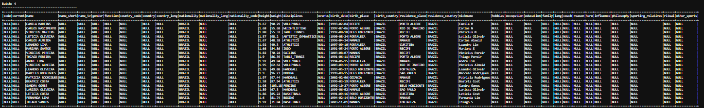
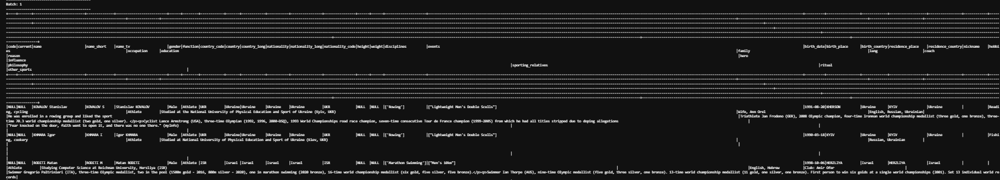
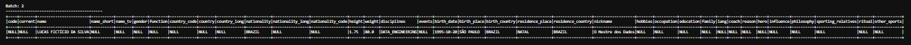
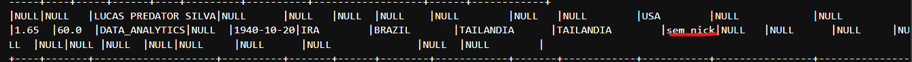

# Projeto – Criação de pipelines de processamento de dados utilizando Apache Spark Streaming

Grupo: Pedro Leandro Batista Marques e Ruan Lucas Brito Neves

# Objetivos do trabalho
Desenvolver pipelines de processamento de dados em tempo real por meio da criação de aplicações Apache Spark Streaming, que serão responsáveis pelo consumo de dados a partir de um Data Lake. O objetivoé garantir a escalabiliade e confiabilidade de operações ETL, com foco na análise e transformação de dados em tempo real.

# Descrição Geral do Projeto

Pretende-se que seja criada uma solução de processamento de dados utilizando Apache Spark Streaming, que deverá consumir dados em tempo real a partir de um Data Lake. O Data Lake deve conter dados estruturados ou semi-estruturados armazenados em bancos de dados PostgreSQL ou MongoDB, bem como arquivos json e csv no sistema de arquivos local. As aplicações Spark deverão ser desenvolvidas em pySpark e deverão consumir os dados em tempo real a partir do Data Lake e realizar transformações e análises dos dados. O Apache Kafka/Debezium deverá ser utilizado para ingestão e entrega de dados em tempo real para as aplicações Spark. A Figura 1 abaixo apresenta a arquitetura sugerida para o projeto. 


# Tarefa 1 e 3: Infraestrutura

A infraestrutura da solução foi feita a partir do [sistema de Cluster com Hadoop e Spark](https://github.com/cmdviegas/hadoop-spark) disponibilizado pelo Professor Carlos M. Viegas. Porém, fizemos algumas adaptações no _docker-compose_, que podem ser consultadas [aqui](./docker-compose.yml). Nossa arquitetura é composta pelos 5 containers do docker abaixo:

1. Um container do Mongo-db;
2. Um container do PosgreSQL;
3. Três Containers para o Spark/hadoop, sendo:
3.1. Um container Mestre (_master_);
3.2. Dois containers Trabalhadores (_worker_);

Além disso, foi necessário fazer a instalação manual de algumas ferramentas no Container mestre, como o _curl_ e _pymongo_. Isso foi feito via terminal:

```bash
$ sudo apt-get update
$ sudo apt-get install *nome_do_pacote*
```

# Tarefa 2: Data Lake

O nosso Data Lake é composto por um [arquivo .csv](./athletes.csv) retirado de um [dataset dos jogos olímpicos de 2024](./https://www.kaggle.com/datasets/piterfm/paris-2024-olympic-summer-games), que contém as informações pessoais de todos os atletas. Além disso, também criamos um [arquivo .json](./atletas_ficticios_30.json) contendo informações de 30 atletas fictícios.

Inicialmente, inserimos os arquivos do Data Lake na pasta `\hadoop-spark\myfiles` (no nosso computador local). Em seguida, criamos uma pasta chamda `data` dentro do hdfs, e após isso, enviamos os arquivos para dentro dessa pasta:

```bash
$ hdfs dfs -mkdir -p /user/myuser/data
$ hdfs dfs -put /home/myuser/myfiles/athletes.csv /user/myuser/data
$ hdfs dfs -put /home/myuser/myfiles/atletas_ficticios_30.json /user/myuser/data
```

> Obs: é possível verificar a inserção dos arquivos no hdfs executando o comando `hdfs dfs -ls /user/myuser/data`.

# Tarefa 4: Configuração do Kafka

## 4.1: Kafka e Debezium
Tivemos dificuldade para subir um container dedicado ao _Kafka_, então instalamos ele e o _Debezium_ manualmente no container mestre do spark, seguindo o [passo a passo](./Instalacao_Manual_Kafka.txt) disponibilizado pelo professor.

Após configurá-lo corretamente, seguimos a sequencia de passos abaixo:

1. Gerar o id do kafka: 
```bash
$ export KAFKA_CLUSTER_ID="$(kafka-storage.sh random-uuid)"
``` 

2. Preparar o diretório de logs
```bash
$ kafka-storage.sh format -t $KAFKA_CLUSTER_ID -c$KAFKA_HOME/config/kraft/server.properties
``` 

3. Iniciar o servidor Kafka com as configurações definidas anteriormente
```bash
$ kafka-server-start.sh $KAFKA_HOME/config/kraft/server.properties
``` 

4. Iniciar o Kafka Connect para integrar-se com Spark Streaming

```bash
$ connect-standalone.sh $KAFKA_HOME/config/connect-standalone.properties
``` 

5. Submetemos o _conector mongo_ (mais informações na seção abaixo) via API REST:

```bash
$ curl -X POST -H "Content-Type: application/json" --data @/home/myuser/kafka/connect/debezium-connector-mongodb/mongoc.json http://spark-master:8083/connectors
```

Obs.: é possível verificar o status do _conector mongo_ executando o comando:

```bash
$ curl http://spark-master:8083/connectors/mongo-connector/status
```


## 4.2 e 4.3: Conecotor mongo

Desenvolvemos um [Debezium para MongoDB](./mongoc.json), que foi configurado para implementar o Change Data Capture (CDC), transformando o banco de dados em uma fonte de dados de streaming em tempo real. Através da conexão com o Replica Set do MongoDB, especificada na URI de conexão, o conector monitora continuamente o log de operações (Oplog) da coleção atletas no banco de dados spark-streaming. 

Então, ao detectar qualquer alteração de dados — seja uma inserção, atualização ou exclusão — o Debezium captura essa mudança, a formata em uma mensagem e a publica imediatamente no tópico Kafka correspondente, topico-mongo.spark-streaming.atletas. Essa arquitetura elimina a necessidade de consultas em lote (batch) e permite que aplicações consumidoras, como o Spark Streaming, processem os eventos de dados de forma reativa e instantânea, assim que eles ocorrem na origem. 

> OBS: iniciamos o mongo em modo _replica-set_, para isso, no  terminal do mongo, entramos no mongosh, e em seguida executamos o comando `rs.initiate()`.

# 5 e 6: Processamento e Armazenamento dos Dados

## Aplicação PySpark
Para a nossa ETL, desenvolvemos uma [aplicação pyspark](./TrabalhoFinal%20(1).ipynb) que executa no _Jupyter Lab_ (dentro no container Mestre do Spark na porta 8888).

Após o import das bibliotecas, criamos a sessão spark:

```python
sp = SparkSession.builder \
    .appName("spark") \
    .config("spark.jars.packages",
           "org.apache.spark:spark-sql-kafka-0-10_2.12:3.4.1,"
           "org.mongodb.spark:mongo-spark-connector_2.12:10.1.1") \
    .config("spark.master", "local[*]") \
    .getOrCreate()
```

Em seguida, cria-se um dataframe do tipo stream, que aponta para o servidor kafka e também para o tópico que será consumido (`topico-mongo`), que monitora a coleção `atletas` do banco de dados `spark-streaming` (no MongoDB).

```python
df = (sp.readStream
        .format("kafka")
        .option("kafka.bootstrap.servers", "spark-master:9092")
        .option("subscribe", "topico-mongo.spark-streaming.atletas")
        .option("startingOffsets", "earliest") 
        .load()
)
```

Após isso, declara-se o esquema para o banco de dados de atletas e então lê-se arquivo .csv do HDFS. Porém, como há muitas colunas neste dataset, reduziu-se as colunas deixando apenas as colunas:

- name
- nickname
- nationality
- disciplines
- height
- weight
- birth_date
- birth_place
- birth_country
- residence_place
- residence_country

E no fim, visualizamos os 10 primeiros atletas deste dataset.

```python
athletes_schema = StructType([
    StructField("code", IntegerType(), True),
    StructField("current", BooleanType(), True),
    StructField("name", StringType(), True),
    StructField("name_short", StringType(), True),
    StructField("name_tv", StringType(), True),
    StructField("gender", StringType(), True),
    StructField("function", StringType(), True),
    StructField("country_code", StringType(), True),
    StructField("country", StringType(), True),
    StructField("country_long", StringType(), True),
    StructField("nationality", StringType(), True),
    StructField("nationality_long", StringType(), True),
    StructField("nationality_code", StringType(), True),
    StructField("height", DoubleType(), True),
    StructField("weight", DoubleType(), True),
    StructField("disciplines", StringType(), True),
    StructField("events", StringType(), True),
    StructField("birth_date", StringType(), True),
    StructField("birth_place", StringType(), True),
    StructField("birth_country", StringType(), True),
    StructField("residence_place", StringType(), True),
    StructField("residence_country", StringType(), True),
    StructField("nickname", StringType(), True),
    StructField("hobbies", StringType(), True),
    StructField("occupation", StringType(), True),
    StructField("education", StringType(), True),
    StructField("family", StringType(), True),
    StructField("lang", StringType(), True),
    StructField("coach", StringType(), True),
    StructField("reason", StringType(), True),
    StructField("hero", StringType(), True),
    StructField("influence", StringType(), True),
    StructField("philosophy", StringType(), True),
    StructField("sporting_relatives", StringType(), True),
    StructField("ritual", StringType(), True),
    StructField("other_sports", StringType(), True)
])

df_completo = sp.read \
    .format("csv") \
    .option("header", "true") \
    .schema(athletes_schema) \
    .load("hdfs://spark-master:9000/user/myuser/data/athletes.csv")

df_selecionado = df_completo.select(
    "name",
    "nickname",
    "nationality",
    "disciplines",
    "height",
    "weight",
    "birth_date",
    "birth_place",
    "birth_country",
    "residence_place",
    "residence_country",
)
print("Dados com colunas selecionadas:")
df_selecionado.show(10, truncate=False)
```

Após a leitura e pré-processamento os dados do .csv, inserimos todos os dados na coleção `atletas` do banco de dados chamado `spark-streaming` do MongoDB.

```python
import csv
from pymongo import MongoClient
client = MongoClient("mongodb://mongo:27017")
db = client["spark-streaming"]
collection = db["atletas"]

collection.delete_many({})

with open("athletes.csv", newline='', encoding="utf-8") as f:
    reader = csv.DictReader(f, delimiter=',')
    documentos = list(reader)
    collection.insert_many(documentos)

print(f"{len(documentos)} documentos inseridos com sucesso no MongoDB")
```

Realizou-se o mesmo procedimento para o arquivo .json. Declara-se o esquema dos dados, lê o .json e exibe alguns registros:

```python
schema_json = StructType([
    StructField("name", StringType(), True),
    StructField("nickname", StringType(), True),
    StructField("nationality", StringType(), True),
    StructField("disciplines", StringType(), True),
    StructField("height", DoubleType(), True),
    StructField("weight", DoubleType(), True),
    StructField("birth_date", StringType(), True),
    StructField("birth_place", StringType(), True),
    StructField("birth_country", StringType(), True),
    StructField("residence_place", StringType(), True),
    StructField("residence_country", StringType(), True)
])

df_json = sp.read \
    .format("json") \
    .option("multiLine", True) \
    .schema(schema_json) \
    .load("hdfs://spark-master:9000/user/myuser/data/atletas_ficticios_30.json")


print("Adicionando dados do JSON na coleção 'atletas'...")
df_json.show(5)
df_json.printSchema()
```
Em seguida, salva-se os dados do .json na mesma coleção e no mesmo banco de dados que os dados do arquivo .csv foram salvos.

```python 
import json
#Salvando no MongoDB
json_data = df_json.toJSON().collect()
batch_size = 100
for i in range(0, len(json_data), batch_size):
    batch = [json.loads(doc) for doc in json_data[i:i+batch_size]]
    collection.insert_many(batch)

print(f"Dados inseridos! Total: {len(json_data)} registros")
```

Em seguida, lê-se a Stream do tópico kafka:

```python
df_kafka = sp.readStream \
    .format("kafka") \
    .option("kafka.bootstrap.servers", "spark-master:9092") \
    .option("subscribe", "topico-mongo.spark-streaming.atletas") \
    .option("startingOffsets", "latest") \
    .load()
```

Após isso, o código abaixo "desembrulha" a mensagem JSON do Debezium vinda do Kafka, extraindo o registro do atleta (que está no campo after) e o transformando em um DataFrame limpo e estruturado com colunas.

```python
debezium_schema = StructType([
    StructField("payload", StructType([
        StructField("after", StringType(), True),
        StructField("op", StringType(), True),
    ]), True)
])

dx = df_kafka.select(from_json(df_kafka.value.cast("string"), debezium_schema).alias("data")) \
       .select("data.payload.after") \
       .withColumn("athlete_data", from_json(col("after"), athletes_schema)) \
       .select("athlete_data.*")
```

Por fim, foi escrito um código que inicia a consulta de streaming, exibindo os dados processados em tempo real diretamente no console, sem cortar o conteúdo das colunas.

```python
print("Aguardando novos dados do Kafka para processar e salvar na coleção de destino...")
ds = dx.writeStream \
    .outputMode("append") \
    .format("console") \
    .option("truncate", False) \
    .start()
```

Com isso, é possível observar nas imagens abaixo o monitoramento em tempo real dos dados, seja na inserção dos dados do .json: 



Seja na inserção dos dados no arquivo .csv:



## Inserção de dados diretamente no console do mongo

Além disso, é possível monitorar inserções realizadas diretamente no shell do mongo, por exemplo, quando executamos o comando abaixo no shell do mongo:

```javascript
db.atletas.insertOne({
    "name": "LUCAS FICTÍCIO DA SILVA",
    "nickname": "O Mestre dos Dados",
    "nationality": "BRAZIL",
    "disciplines": "DATA_ENGINEERING",
    "height": 1.75,
    "weight": 80.0,
    "birth_date": "1995-10-20",
    "birth_place": "SÃO PAULO",
    "birth_country": "BRAZIL",
    "residence_place": "NATAL",
    "residence_country": "BRAZIL"
})
```

É possível observar o processamento deste lote na aplicação pyspark:



## Transformação de dados

Por fim, realizamos uma pequena transformação nos dados. Alguns atletas não possuem apelido ("nickname"), e no banco de dados, isso está registrado como null. Então substituimos o null por por "sem nick".

```python
dx = dx.fillna("sem nick", subset=["nickname"])
```

Assim como nos casos anteriores, essa mudança também é vista pelo kafka:

