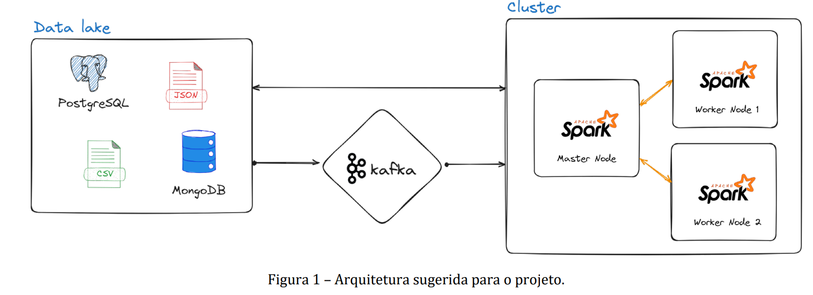

# Projeto – Criação de pipelines de processamento de dados utilizando Apache Spark Streaming

Grupo: Pedro Leandro Batista Marques e Ruan Lucas Brito Neves

# Objetivos do trabalho
Desenvolver pipelines de processamento de dados em tempo real por meio da criação de aplicações Apache Spark Streaming, que serão responsáveis pelo consumo de dados a partir de um Data Lake. O objetivoé garantir a escalabiliade e confiabilidade de operações ETL, com foco na análise e transformação de dados em tempo real.

# Descrição Geral do Projeto

Pretende-se que seja criada uma solução de processamento de dados utilizando Apache Spark Streaming, que deverá consumir dados em tempo real a partir de um Data Lake. O Data Lake deve conter dados estruturados ou semi-estruturados armazenados em bancos de dados PostgreSQL ou MongoDB, bem como arquivos json e csv no sistema de arquivos local. As aplicações Spark deverão ser desenvolvidas em pySpark e deverão consumir os dados em tempo real a partir do Data Lake e realizar transformações e análises dos dados. O Apache Kafka/Debezium deverá ser utilizado para ingestão e entrega de dados em tempo real para as aplicações Spark. A Figura 1 abaixo apresenta a arquitetura sugerida para o projeto. 



# Tarefa 1 e 3: Infraestrutura

A infraestrutura da solução foi feita a partir do [sistema de Cluster com Hadoop e Spark](https://github.com/cmdviegas/hadoop-spark) disponibilizado pelo Professor Carlos M. Viegas. Porém, fizemos algumas adaptações no _docker-compose_, que podem ser consultadas [aqui](./docker-compose.yml). Nossa arquitetura é composta pelos 5 containers do docker abaixo:

1. Um container do Mongo-db;
2. Um container do PosgreSQL;
3. Três Containers para o Spark/hadoop, sendo:
3.1. Um container Mestre (_master_);
3.2. Dois containers Trabalhadores (_worker_);

Além disso, foi necessário fazer a instalação manual de algumas ferramentas no Container mestre, como o _curl_ e _pymongo_. Isso foi feito via terminal:

```bash
$ sudo apt-get update
$ sudo apt-get install *nome_do_pacote*
```

# Tarefa 2: Data Lake

O nosso Data Lake é composto por um [arquivo .csv](./athletes.csv) retirado de um [dataset dos jogos olímpicos de 2024](./https://www.kaggle.com/datasets/piterfm/paris-2024-olympic-summer-games), que contém as informações pessoais de todos os atletas. Além disso, também criamos um [arquivo .json](./atletas_ficticios_30.json) contendo informações de 30 atletas fictícios.

Inicialmente, inserimos os arquivos do Data Lake na pasta `\hadoop-spark\myfiles` (no nosso computador local). Em seguida, criamos uma pasta chamda `data` dentro do hdfs, e após isso, enviamos os arquivos para dentro dessa pasta:

```bash
$ hdfs dfs -mkdir -p /user/myuser/data
$ hdfs dfs -put /home/myuser/myfiles/athletes.csv /user/myuser/data
$ hdfs dfs -put /home/myuser/myfiles/atletas_ficticios_30.json /user/myuser/data
```

# Tarefa 4: Configuração do Kafka

## 4.1: Kafka e Debezium
Tivemos dificuldade para subir um container dedicado ao _Kafka_, então instalamos ele e o _Debezium_ manualmente no container mestre do spark, seguindo o [passo a passo](./Instalacao_Manual_Kafka.txt) disponibilizado pelo professor.

Após configurá-lo corretamente, seguimos a sequencia de passos abaixo:

1. Gerar o id do kafka: 
```bash
$ export KAFKA_CLUSTER_ID="$(kafka-storage.sh random-uuid)"
``` 

2. Preparar o diretório de logs
```bash
$ kafka-storage.sh format -t $KAFKA_CLUSTER_ID -c$KAFKA_HOME/config/kraft/server.properties
``` 

3. Iniciar o servidor Kafka com as configurações definidas anteriormente
```bash
$ kafka-server-start.sh $KAFKA_HOME/config/kraft/server.properties
``` 

4. Iniciar o Kafka Connect para integrar-se com Spark Streaming

```bash
$ connect-standalone.sh $KAFKA_HOME/config/connect-standalone.properties
``` 

## 4.2 e 4.3 Conecotor mongo

Desenvolvemos um [Debezium para MongoDB](./mongoc.json), que foi configurado para implementar o Change Data Capture (CDC), transformando o banco de dados em uma fonte de dados de streaming em tempo real. Através da conexão com o Replica Set do MongoDB, especificada na URI de conexão, o conector monitora continuamente o log de operações (Oplog) da coleção atletas no banco de dados spark-streaming. 

Então, ao detectar qualquer alteração de dados — seja uma inserção, atualização ou exclusão — o Debezium captura essa mudança, a formata em uma mensagem e a publica imediatamente no tópico Kafka correspondente, topico-mongo.spark-streaming.atletas. Essa arquitetura elimina a necessidade de consultas em lote (batch) e permite que aplicações consumidoras, como o Spark Streaming, processem os eventos de dados de forma reativa e instantânea, assim que eles ocorrem na origem. 

> OBS: iniciamos o mongo em modo _replica-set_, para isso, no  terminal do mongo, entramos no mongosh, e em seguida executamos o comando `rs.initiate()`.